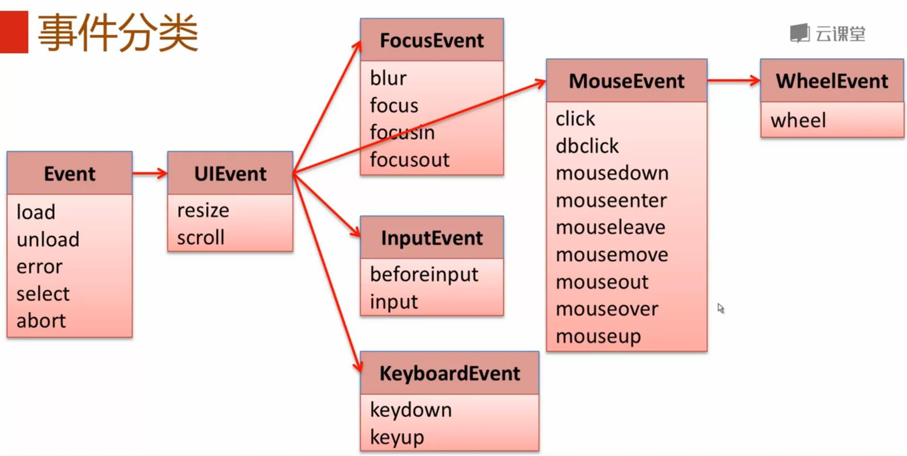

# 事件分类

* Event : load\|unload\|error\|select\|abort
* UIEvent : resize\|scroll
* FoucusEvent : blur\|focus\|focusin\|focusout
* InputEvent : beforeinput\|input
* KeyboardEvent : keydown\|keyup
* MouseEvent : click\|dbclick\|mousedown\|mouseenter\|mouseleave\|mousemove\|mouseout\|mouseover\|mouseup
* WheelEvent : wheel

## Event

| 事件类型 | 是否冒泡 | 元素 | 默认事件 | 元素例子 |
| :--- | :--- | :--- | :--- | :--- |
| load | NO | Window,Document,Element | None | window,image,iframe |
| unload | NO | Window,Document,Element | None | window |
| error | NO | Window,Document | None | window,image |
| select | NO | Element | None | input,textarea |
| abort | NO | Window,Element | None | window,image |

## 未完待续 。。。

